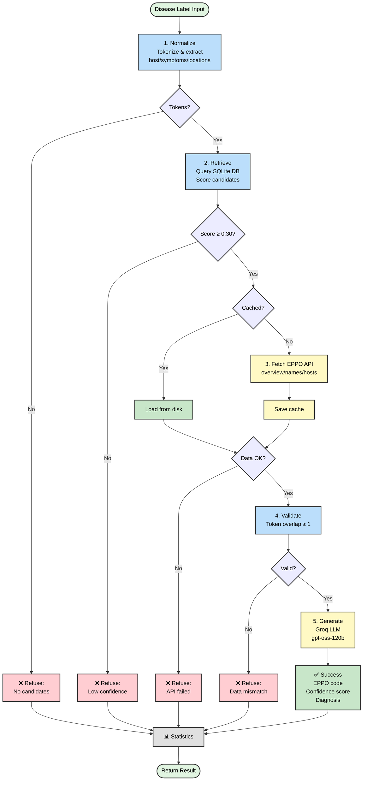

# 🌿 GreenRetrieval

**Retrieval-Augmented Generation (RAG) system for plant disease diagnosis** — Combines EPPO Global Database taxonomic grounding with LLM-powered natural language synthesis to ensure factually accurate, hallucination-free plant pathology responses.

---

## 🎯 Core Concept

<div align="center">

### 🚨 The Problem

**Traditional LLMs hallucinate** when queried about specialized domains like plant pathology

### 💡 Our Solution

**Refusal-aware RAG pipeline** with validated retrieval

</div>

---

### 🔄 Pipeline Architecture

<table>
<tr>
<td align="center" width="16%">

**📸 Input**

`CV Label`

_"Tomato blight"_

</td>
<td align="center">→</td>
<td align="center" width="16%">

**🔤 Normalize**

`Tokens`

_[tomato, late, blight]_

</td>
<td align="center">→</td>
<td align="center" width="16%">

**🔍 Retrieve**

`SQLite`

_121K codes_

</td>
<td align="center">→</td>
<td align="center" width="16%">

**📊 Rank**

`Score`

_θ ≥ 0.3_

</td>
<td align="center">→</td>
<td align="center" width="16%">

**✅ Validate**

`Check`

_σ ≥ 1_

</td>
<td align="center">→</td>
<td align="center" width="16%">

**🤖 Generate**

`Groq LLM`

_Structured response_

</td>
</tr>
</table>

---

<table>
<tr>
<td width="50%">

#### ✅ When Confident ($\theta \geq 0.3$)

```python
✓ High semantic overlap detected
✓ EPPO facts validated
✓ Generate structured diagnosis
→ Response: Full 4-section report
```

</td>
<td width="50%">

#### 🚫 When Uncertain ($\theta < 0.3$)

```python
✗ Low confidence score
✗ Insufficient token overlap
✗ Refuse to diagnose
→ Response: "Cannot verify with confidence"
```

</td>
</tr>
</table>

> **🎯 Design Principle**: Prioritize **precision over recall** — Better to refuse than to misdiagnose.  
> This ensures agricultural decisions are based on verified information, not LLM hallucinations.

---

### 🗺️ Complete Pipeline Flow

<div align="center">



</div>

**Legend**:

- 🟢 **Green**: Entry/Exit points and successful paths
- 🔵 **Blue**: Core processing steps (Normalize, Retrieve)
- 🟡 **Yellow**: External services (EPPO API, LLM)
- 🔴 **Red**: Refusal points (4 safety gates)

---

## 📐 Retrieval Scoring Function

Candidate EPPO codes are ranked using a composite score:

$$
S(c, q) = \min\left(\frac{|T_c \cap T_q|}{|T_q|} + \beta_h \cdot h(c, q) + \beta_\ell \cdot \ell(c, q) + \beta_d \cdot d(c), \, 1.5\right)
$$

Where:

- $T_c$: Token set of candidate name
- $T_q$: Token set of normalized query
- $h(c, q) \in \{0, 0.2\}$: Host match bonus (first token overlap)
- $\ell(c, q) \in [0, 0.3]$: Location term match ratio (leaf, stem, root, etc.)
- $d(c) \in \{0, 0.05, 0.15\}$: Datatype preference (GAF=primary pathogen, SFT=group)

**Design Insight**: The cap at 1.5 prevents exact-match overfitting while allowing multi-factor discrimination. Location terms receive high weight ($\beta_\ell = 0.3$) as "leaf rust" ≠ "stem rust" in phytopathology.

---

## 🏗️ Architecture

```
src/
├── config.py          # Centralized constants (θ=0.3, β coefficients, model configs)
├── normalization.py   # Token extraction: L → {host, symptoms, locations}
├── retrieval.py       # SQLite query + scoring: S(c, q) → ranked candidates
├── eppo_client.py     # API wrapper (rate limiting, exponential backoff, disk cache)
├── validation.py      # Post-retrieval check: |T_eppo ∩ T_query| ≥ σ
├── generation.py      # Groq LLM (openai/gpt-oss-120b, 120B params, structured prompts)
└── pipeline.py        # Orchestration: diagnose() with early-exit refusals
```

**Data Flow**:

1. **Offline**: 121,370 EPPO codes in `eppocodes_all.sqlite` (~50MB)
2. **Online**: API calls for `overview`, `names`, `hosts` (cached, 60 req/10s limit)
3. **LLM**: Structured 4-section response (Confirmation, Overview, Treatment, Prevention)

---

## 🚀 Usage

### Python Package

```python
from src import diagnose

result = diagnose("Rice leaf blast")

if not result.refused:
    print(result.message)          # LLM-generated diagnosis
    print(f"EPPO: {result.eppocode}")  # PYRIOR (Magnaporthe oryzae)
    print(f"θ = {result.confidence:.2f}")  # 0.85
```

### Command Line

```bash
export EPPO_API_KEY="..." GROQ_API_KEY="..." EPPO_SQLITE_PATH="eppocodes_all.sqlite"
python run.py  # Batch diagnoses with progress bars + statistics
```

### Google Colab

Open `run_colab.ipynb` for interactive notebook with step-by-step cells.

---

## 🧮 Performance Characteristics

<table>
<tr>
<td width="50%">

### 📊 System Metrics

| Metric                      | Value                         |
| --------------------------- | ----------------------------- |
| 🗄️ **Database Size**        | **121,370** active EPPO codes |
| 🎯 **Confidence Threshold** | $\theta = 0.3$                |
| 💾 **Cache Hit Rate**       | **~80%** (typical)            |
| ⚡ **Avg. Latency**         | **2-3 seconds**               |

</td>
<td width="50%">

### 🤖 LLM Configuration

| Parameter          | Value                 |
| ------------------ | --------------------- |
| 🧠 **Model**       | `openai/gpt-oss-120b` |
| 🚀 **Throughput**  | 500 tokens/second     |
| 📈 **Rate Limit**  | 250K TPM              |
| 🌡️ **Temperature** | 0.3 (factual)         |

</td>
</tr>
</table>

#### 📐 Latency Breakdown

```
┌─────────────────────────────────────┐
│ Retrieval (SQLite)     │ 0.5s │ 20% │
│ LLM Generation (Groq)  │ 1.5s │ 60% │
│ API Calls (EPPO)       │ 0.5s │ 20% │
└─────────────────────────────────────┘
```

#### 🎓 Design Philosophy

> **High Precision over High Recall**  
> The system prioritizes **accuracy** by refusing uncertain matches ($\theta < 0.3$) rather than providing potentially incorrect diagnoses. This design choice is critical for agricultural decision-making where false positives can lead to:
>
> - ❌ Unnecessary pesticide application
> - 💰 Economic losses from wrong treatments
> - 🌍 Environmental damage from improper interventions

**Coverage**: Full taxonomic coverage including fungi 🍄, bacteria 🦠, viruses 🧬, and pests 🐛

---

## 📊 Key Modules

### `normalization.py` — Semantic Decomposition

Extracts structured components from raw CV labels:

- **Tokens**: `["rice", "leaf", "blast"]` (length ≥ 2, generic terms filtered)
- **Hosts**: First token(s) matching known plant genera
- **Symptoms**: Remaining tokens (`["blight", "rust", "mosaic", ...]`)
- **Locations**: Preserved separately (`["leaf", "stem", ...]`) for scoring bonus

### `retrieval.py` — Candidate Ranking

- **SQL**: `LIKE` query across 121K codes (indexed, ~50ms)
- **Deduplication**: Best name per (EPPO code, datatype) tuple
- **Scoring**: $S(c, q)$ with multi-factor bonuses
- **Sorting**: Descending by score, top-$k$ retained ($k=50$ default)

### `eppo_client.py` — API Resilience

- **Rate Limiting**: 200ms delay between requests (< 60/10s EPPO limit)
- **Retries**: 3 attempts with exponential backoff (0.5s, 1s, 2s)
- **Caching**: JSON files in `.eppo_cache/taxons/{CODE}/` (persistent across runs)

### `generation.py` — Structured LLM Prompts

- **System Role**: Expert plant pathologist persona
- **User Prompt**: EPPO facts + 4-section template enforcement
- **Temperature**: $T = 0.3$ (low randomness for factual responses)
- **Max Tokens**: 1024 (sufficient for structured output)

---

## 🔬 Example Workflow

```python
# Input: CV model predicts "Wheat leaf rust"
label = "Wheat leaf rust"

# 1. Normalization
norm = normalize_cv_label(label)
# → tokens: ["wheat", "leaf", "rust"]
# → location_terms: ["leaf"]

# 2. Retrieval (SQLite query)
candidates = query_candidates(db, norm)
# → Top match: "rust of wheat" (PUCCRT), S = 0.95

# 3. Selection (θ = 0.3)
best = select_best(candidates, threshold=0.3)
# → PUCCRT (Puccinia recondita f. sp. tritici)

# 4. Validation (EPPO API + token overlap)
facts = eppo_client.fetch_facts("PUCCRT")
valid = validate(facts, norm)  # σ = 1 token minimum
# → True (overlap: "wheat", "rust")

# 5. Generation (Groq LLM)
response = generator.generate(label, facts)
# → Structured 4-section markdown response

# Result
DiagnosisResult(
    refused=False,
    message="**1. CONFIRMATION**\nYES, the prediction matches...",
    eppocode="PUCCRT",
    confidence=0.95
)
```

---

## 📁 File Structure

```
GreenRetrieval/
├── src/                    # Modular Python package (8 modules)
│   ├── config.py
│   ├── normalization.py
│   ├── retrieval.py
│   ├── eppo_client.py
│   ├── validation.py
│   ├── generation.py
│   └── pipeline.py
├── run.py                  # CLI entry point with progress tracking
├── run_colab.ipynb         # Self-contained Colab notebook
├── requirements.txt        # groq, requests, tqdm
└── README.md              # You are here
```

---

## 🔑 Environment Variables

```bash
EPPO_API_KEY       # Get from https://data.eppo.int (free tier available)
GROQ_API_KEY       # Get from https://console.groq.com (free tier: 14,400 req/day)
EPPO_SQLITE_PATH   # Download from https://www.eppo.int/download (~50MB .zip)
EPPO_CACHE_DIR     # Optional: custom cache location (default: .eppo_cache)
```

---

## 🎓 References

- **EPPO Global Database**: Authoritative plant health data (200+ countries, 88K taxa)
- **Groq Inference**: LPU-accelerated LLM serving (500 tokens/sec)
- **RAG Pattern**: Combines retrieval precision with generative fluency

---

**Built with 🌱 for reliable agricultural AI**
